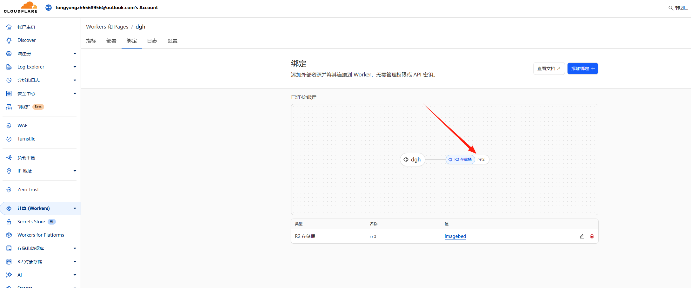

本项目目标：  

通过 Cloudflare Worker 实现一个 API，自动遍历 Cloudflare R2 存储桶，批量获取并输出所有图片的公网可访问直链，前端页面可一键获取和导出所有图片链接，保持原有文件夹结构。

### 1. Worker 基础开发与 API 设计

- 编写 Cloudflare Worker 脚本，监听 `/api/list` 路由。
- Worker 通过 `env.[R2绑定名].list()` API 遍历存储桶所有对象，实现分页获取。
  - 这个一定要绑定对
  - 
- 过滤出所有图片类型对象（如 .jpg/.png/.gif 等）。
- 拼接为公网可访问的图片直链，返回 JSON 列表。

### 2. R2 绑定与权限设置

- 在 Cloudflare 控制台为 Worker 添加 R2 存储桶绑定，变量命名要和代码一致（如 `env.rr2`）。
- 桶需设置为“公开”，才能使用 `.r2.dev` 域名直接访问图片。
- 理解 S3 API 域名与 R2 公共开发域名（.r2.dev）的区别。

### 3. 前端页面开发

- 使用简单 HTML/JS，实现“自动获取全部图片”“一键导出直链”功能。
- 前端通过 **fetch 调用 Worker API**，渲染图片列表并可导出为 txt 批量下载。


# 代码

- 重点是这个` url:https://pub-f13800668670486eb3e27e97e97fbca7.r2.dev/${obj.key}` 
- 这个是R2 对象存储公共开发 URL ` https://pub-f13800668670486eb3e27e97e97fbca7.r2.dev `在R2 对象存储--->设置里面获取
- 下面是运行在Worker 上的代码，
- 每创建一个Worker 总览里面还有一个属于Worker 的子域名  ` tongyongzh6568956.workers.dev`
- 这个为API  地址为 ` 'https://dgh.tongyongzh6568956.workers.dev/api/list`

```js
export default {
  async fetch(request, env) {
    const url = new URL(request.url);
    if (url.pathname === "/") {
      return new Response("Worker运行成功。请用/api/list调用API。", {
        headers: { "content-type": "text/plain; charset=utf-8" }
      });
    }
    if (url.pathname === "/api/list") {
      try {
        let cursor = undefined;
        let allObjects = [];
        do {
          const list = await env.rr2.list({ cursor, limit: 1000 }); // 这里改成 rr2
          allObjects = allObjects.concat(list.objects);
          cursor = list.truncated ? list.cursor : undefined;
        } while (cursor);

        const imageExt = /\.(jpg|jpeg|png|gif|webp|bmp|svg)$/i;
        const files = allObjects
          .filter(obj => imageExt.test(obj.key))
          .map(obj => ({
            key: obj.key,
            url: `https://pub-f13800668670486eb3e27e97e97fbca7.r2.dev/${obj.key}`
          }));

        return new Response(JSON.stringify(files), {
          headers: {
            "content-type": "application/json",
            "Access-Control-Allow-Origin": "*"
          }
        });
      } catch (e) {
        return new Response("R2 Exception: " + (e && e.message), {
          status: 500,
          headers: { "Access-Control-Allow-Origin": "*" }
        });
      }
    }
    return new Response("Not Found", { status: 404 });
  }
}
```

